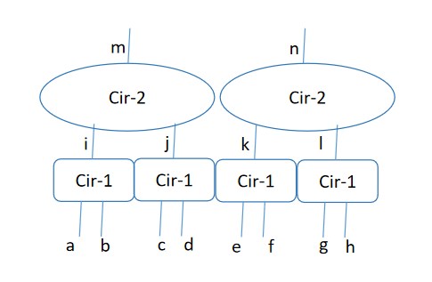

# ZKCuda Backend

We're currently using [Expander](https://github.com/PolyhedraZK/Expander) as our backend proving system, but we believe that ZKCuda is more than that, it works more like a computation graph, and can be combined with many other proving systems such as Groth16 and Plonk.

## Problem Description
We'll illustrate how the proving works with the following example.

Assuming we're given such a computation graph with four copies of `Cir-1` in the first layer, and two copies of `Cir-2` in the second one. While it's possible to treat the entire computation graph as a whole big circuit, it is sometimes more efficient to separate them apart, and exploit the potential of parallel execution of the underlying proving system.

## ZKCuda with Expander
When using ZKCuda with Expander, the entire proving can be divided into the following steps:

1. Forward Computation: given all the input $[a, b, c, d, e, f, g, h]$, compute the intermediate values and the output $[i, j, k, l, m, n]$.
2. Commit to the input and output of all circuits. In this case, we will commit to $[a, b], [c, d], [e, f], [g, h], [i], [j], [k], [l], [m], [n]$.
3. Backward Proving (Single-Core): 
    1. Proves the correctness of `Cir-2`, reducing the claim for $[m]$ to a claim for $[i, j]$. Note that we're commiting $[i], [j]$ separately. However, since we're treating them as multi-linear polynomials, a claim for $[i, j]$ can be easily verified by opening $[i], [j]$ separetely. We can repeat the same proving process to reduce the claim for $[n]$ to claims for $[k, l]$, and proves that by opening $[k]$ and $[l]$ separately. 
    2. Similarly, reduce claims for $[i], [j], [k], [l]$ to claims for $[a, b], [c, d], [e, f], [g, h]$.
    3. In total, we prove gkr for `Cir-2` twice and `Cir-1` four times, and we open $[m], [n], [a], [b], [c], [d], [e], [f], [g], [h]$ once, $[i], [j], [k], [l]$ twice(one for input, one for output).
4. Backward Proving (Multi-Core): Assuming we have 2 cores, and we can prove two copies of the same circuit at a time. In this case, we can use gkr to reduce the claims for $[m, n]$ to claims for $[i, j, k, l]$, and similarly, reduce $[i, j]$ to $[a, b, c, d]$, $[k, l]$ to $[e, f, g, h]$. We'll have exactly the same number of polynomial commitment openings as the single-core proving in this case, but the proving becomes parallel, and due to the property of GKR, the proof size is nearly halved.

### Potential Optimizations
1. For the intermediate wires $[i], [j], [k], [l]$, we do not have to ask the verifier to generate some new challenges, instead, we can reuse the claims reduced from $[m], [n]$.