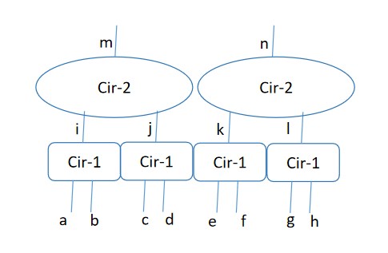
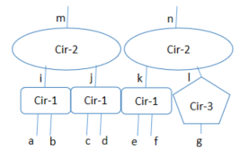

# ZKCuda
ZKCuda is essentially a computation graph consisting of different types of circuits(kernels), and each of which may have different multiplicities. At the very beginning, our motivation is to explore kernel-level parallelization, which ressembles the logic of Cuda execution, and that's why we call it ZKCuda. 

## Kernel-level Parallelization
To explore kernel-level parallelization means to prove parallelly the same kernel on multiple piece of data. In case of GKR, we can reduce the proof size and verification time nearly by the multiplicities without comprimising the proving time a lot (assuming enough cpu cores). We'll illustrate how it works with the following example.

The computation graph has four copies of `Cir-1`, and two copies of `Cir-2` as illustrated. With GKR, the entire proving process can be divided into the following steps:

1. Forward Computation: given all the input $a, b, c, d, e, f, g, h$, compute the intermediate values and the output $i, j, k, l, m, n$.
2. Commit to the input and output of all circuits. In this case, we will commit to $[a, b], [c, d], [e, f], [g, h], [i], [j], [k], [l], [m], [n]$. Inputs in the same brackets are treated as a whole vector to commit.
3. GKR Backward Proving (Single-Core): 
    1. Proves the correctness of `Cir-2`, reducing the claim for $[m]$ to a claim for $[i, j]$. Note that we're commiting $[i], [j]$ separately. However, since we're treating them as multi-linear polynomials in GKR, a claim for $[i, j]$ can be easily verified by opening the commitments of $[i], [j]$ separetely. We can repeat the same proving process to reduce the claim for $[n]$ to the claim for $[k, l]$, and prove that by opening $[k]$ and $[l]$ separately. 
    2. Similarly, reduce claims for $[i], [j], [k], [l]$ to claims for $[a, b], [c, d], [e, f], [g, h]$, which we have committed.
    3. In total, GKR is invoked twice for `Cir-2` and four times for `Cir-1`.
4. GKR Backward Proving (Multi-Core): An alternative approach is to do this parallelly. Assuming we have 2 cores, we can reduce the claims for $[m, n]$ to the claims for $[i, j, k, l]$ by invoking GKR only once, and similarly, reduce $[i, j]$ to $[a, b, c, d]$, $[k, l]$ to $[e, f, g, h]$ by invoking GKR twice. The good part is that the proof size and verification time will nearly half, and the proving time is almost the same with two cores.

## Across-Kernel Parallelization
Kernel-level parallization is good in the sense that it treated GKR as a blackbox, more specifically, a 'claim reduction' tool from the output to the input. The commitment and opening of the input/output need to handled more carefully, but still, it is relatively simple. Kernel-level parallization, however, also comes with some disadvantages. For example, we're producing 6 proofs in the single-core proving case, and 3 proofs in the two-core proving case. Since GKR proof is sub-linear to the circuit size, the total proof size is larger than the case where we treat the whole computation graph as a whole, and produce only a single proof. The extra commitment and opening of intemediate values also introduce some extra costs in terms of proving time, verification time and proof size.

So here comes the problem: is there a way to treat the circuit as a whole, but maximizing the parallism? We're actively working on the problem now.

In a simpler case, if each layer only has repeated structures as illustrated in the first figure, we can distribute the proving to cores and as previous. However, in practice, the circuit may have some weird structures as shown below:

Here there is a standalone `Cir-3` with a different circuit structure, and even different input size. The output size is assumed to be the same as `Cir-1` since it is then used by `Cir-2`. 

(Requires familarity with GKR and Sumcheck from here on.)

### First Attempt 
A first attempt is to distribute three `Cir-1`s to the first three cores, and `Cir-3` to the fourth. The sumcheck bits can be divided into 2 parts, i.e. $a$ and $b$:

$$
(a_0, a_1, ..., a_n, b_0, b_1, ..., b_m)
$$

where $a$ index into the gates in a sub-circuit, and $b$ refers to which sub-circuit it is. Note that $n$ will be logarithmic value of the largest sub-circuit, and $m$ will be the logarithmic value of the number of sub-circuits. The low-degree polynomial in each round of sumcheck can be aggregated from the low-degree polynomial of each sub-sumcheck, and the fiat-shamir challenge can then be computed and broadcasted. However, there might be some problems for this solution.

1. If `Cir-3` is significantly larger than `Cir-1` in width, say 1000x, trivially implementing the folding in sumcheck will increase the cost of proving each `Cir-1` independently due to the alignment to the largest sub-circuit. (Quick thoughts: not a big problem though when carefully handled?)

2. If `Cir-1` is significantly larger than `Cir-3` in width, say 1000x and there are 4 instead of 3 `Cir-1`, adding a standalone `Cir-3` will double the sumcheck cost due to the alignment issue. (The case $m' = m + 1$. Quick thoughts: Doesn't seem to be a big problem? This only doubles the $m$ part.) 

3. If `Cir-1` and `Cir-3` differs a lot in depth, then either some cores will be idle or we'll have to write sophisticated scheduler of workloads.

4. In practice, we may not have enough cores to take care of all the sub-circuit, we may have 16 cores, but there are 32 copies of `Cir-1` and a single `Cir-3`, and we want syncronization of fiat-shamir across all the 33 circuits. (Quick thoughts: still careful engineering work here.)