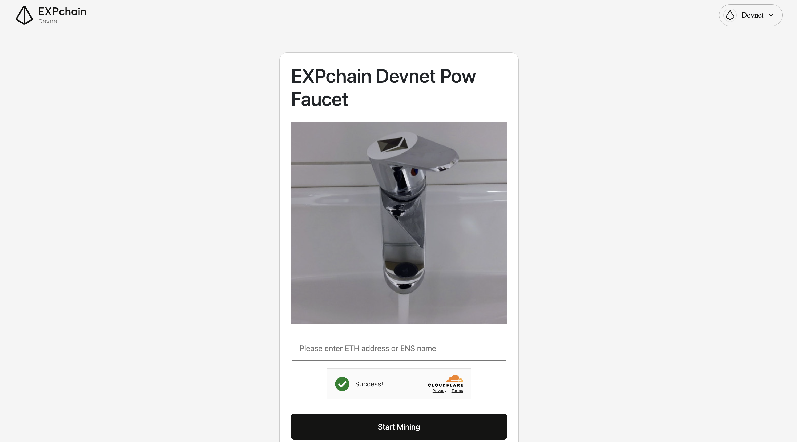
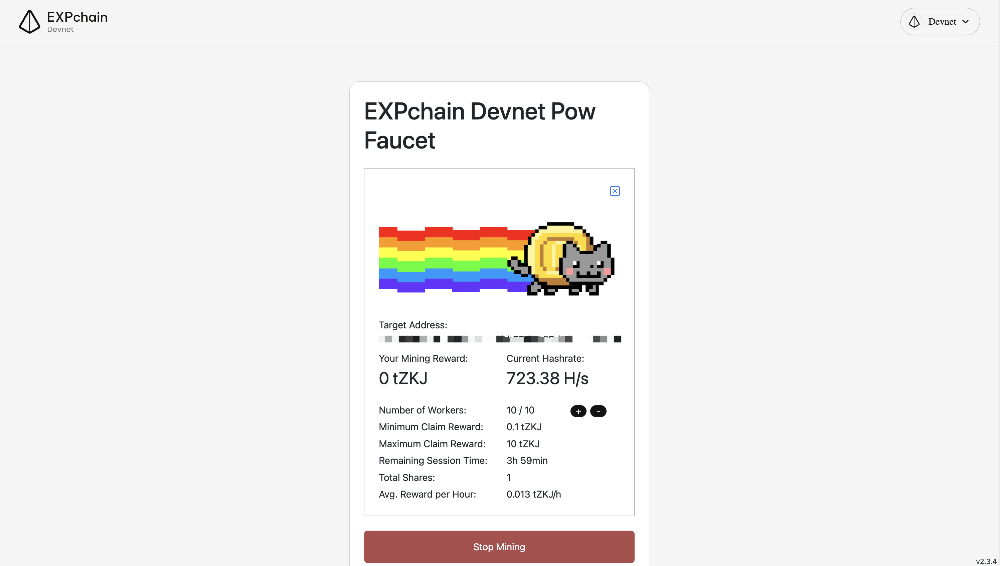

# Testnet Faucet

To get Test tokens on EXPchain Testnet, faucets are available on EXPchain Testnet, ETH Sepolia and BSC Testnet at [https://faucet.expchain.ai](https://faucet.expchain.ai)

- Select a Network: Choose from EXPchain Testnet, ETH Sepolia, or BSC Testnet.
- Input your address to claim the test token.
- 0.01 tZKJ per 24 hours on each network.
- To apply for a significant allocation of test tokens, please submit a request to the DC administrator.

> 🌟To use test tokens acquired from Sepolia or BSC Testnet, they must be bridged to the EXPchain Testnet.

# Devnet Faucet

To get Test tokens on EXPchain Devnet, visit the EXPchain Devnet faucet at [https://faucet-devnet.expchain.ai/](https://faucet-devnet.expchain.ai/)

- Input your address to start the token mining.

- When you've collected enough tZKJ, stop mining and claim your rewards.

